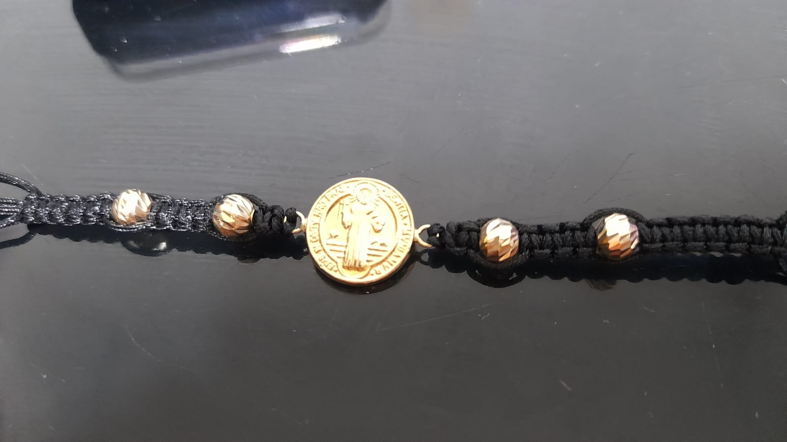
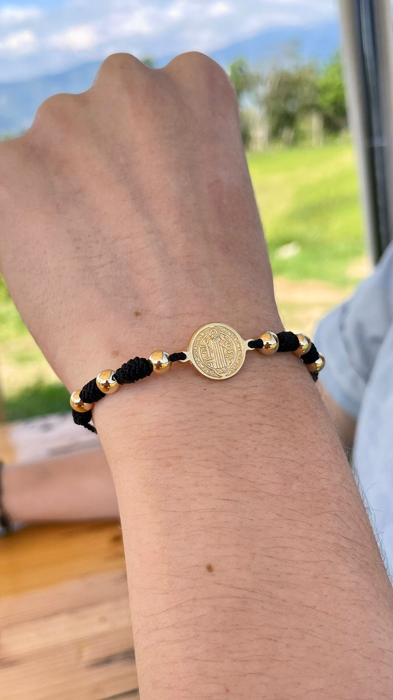
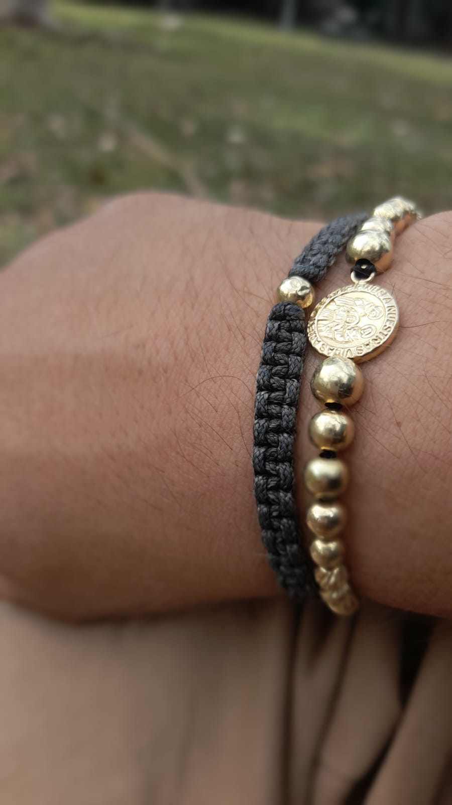
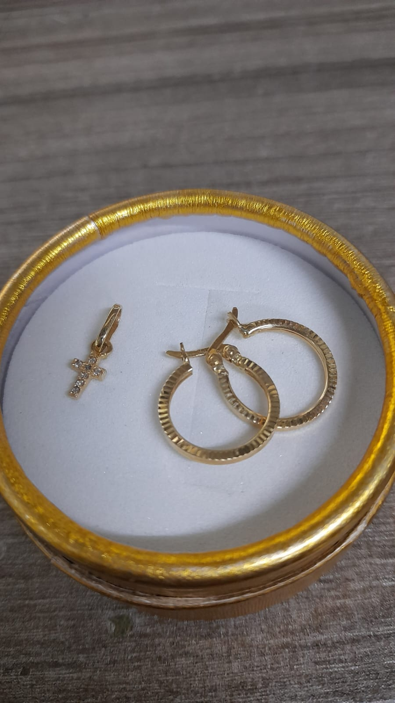
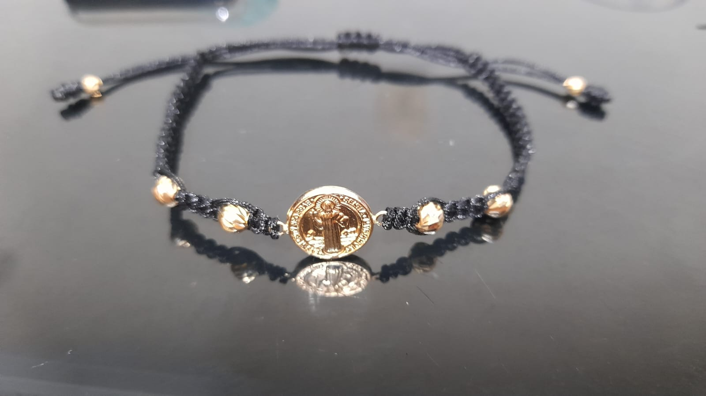
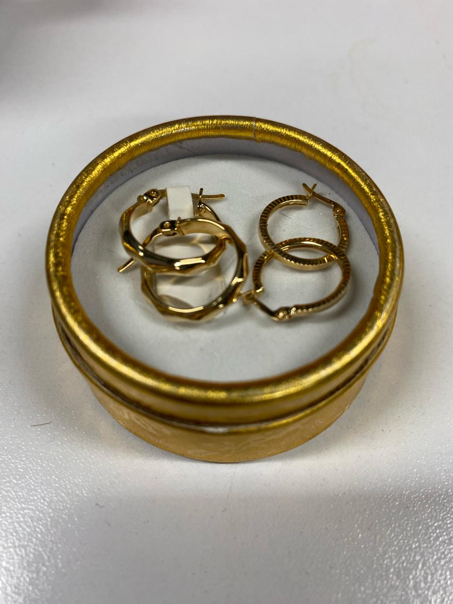

<!DOCTYPE html>
<html lang="es">
<head>
    <meta charset="UTF-8">
    <meta name="viewport" content="width=device-width, initial-scale=1.0">
    <title>GOLD-JUNIIOR</title>
    
</head>
<body>

    <!-- Sección para la foto principal -->
    

        

            
            <h1>GOLD JUNIIOR</h1>
            
            <!-- Frame para el código QR -->
            

                <!-- Aquí puedes insertar tu código QR o enlaces necesarios -->
                <!-- Por ejemplo, puedes usar la etiqueta  para el código QR -->
                <!--  -->
                <!-- Asegúrate de cambiar la ruta del código QR según tus necesidades -->
            

        

    

    <!-- Separador entre la imagen principal y el catálogo -->
    

    <!-- Sección para el catálogo de fotos -->
    

        <!-- Carrusel de imágenes (galería de fotos) -->
        

            <!-- Imagen "madre.gif" en la parte superior izquierda -->
            

                 
                <!-- Asegúrate de cambiar la ruta del GIF según tus necesidades -->
            

            

            

                
                <!-- Nuevo Frame para el GIF "promo.gif" al lado de la imagen "3A.jpeg" -->
                

                     
                    <!-- Asegúrate de cambiar la ruta del GIF según tus necesidades -->
                

            

            

            

            

            

            <!-- Añade más imágenes según sea necesario -->
        

    

    <!-- Botón de contacto por WhatsApp -->
    

        <a href="https://wa.me/3507549786" target="_blank" class="whatsapp-button">Contactar por WhatsApp</a>
    

    
    
    

</body>
</html>
